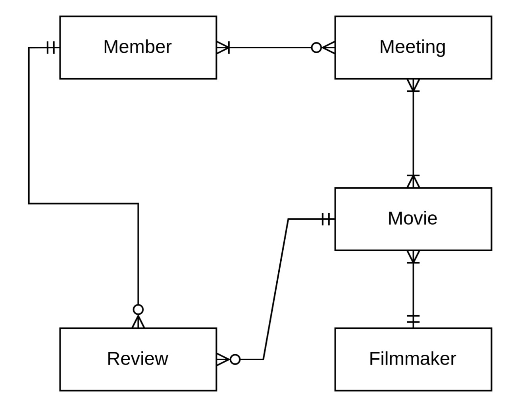

# Проект "Movie Club"

## Введение

### Цель работы
Целью данного проекта является получение практических навыков работы с промышленными СУБД, проектирование базы данных (концептуальное, логическое, физическое), создание хранимых процедур, триггеров, индексов, а также написание и тестирование сложных SQL-запросов (DQ — Data Quality). Проект направлен на изучение и применение различных конструкций SQL, таких как `JOIN`, оконные функции, подзапросы, `GROUP BY`, `HAVING`, `LIMIT/OFFSET` и другие.

---

## Инструменты
- **PostgreSQL 14.17**: Используется в качестве основной СУБД для создания и управления базой данных.
- **Git**: Для управления версиями кода и документации.

---

## Описание проекта
Проект "Movie Club" представляет собой базу данных, предназначенную для управления киноклубом. База данных хранит информацию о фильмах, режиссёрах, участниках киноклуба, киновстречах, регистрациях на встречи, обсуждениях фильмов и рецензиях. Основная цель проекта — создать систему, которая позволяет отслеживать активность участников, анализировать рейтинги фильмов и организовывать киновстречи.

---

## Предметная область и сущности

### Сущности
1. **Filmmaker (Режиссёр)**: Информация о режиссёрах, включая их имя, фамилию, дату рождения, пол и описание.
2. **Movie (Фильм)**: Информация о фильмах, включая название, жанр, рейтинг, описание и ссылку на режиссёра.
3. **Meeting (Киновстреча)**: Информация о киновстречах, включая название и дату проведения.
4. **Member (Участник)**: Информация об участниках киноклуба, включая имя, фамилию, дату рождения, пол и период активности (версионные данные с `valid_from` и `valid_to`).
5. **Meeting Registration (Регистрация на киновстречу)**: Связка между участниками и киновстречами, показывающая, кто зарегистрирован на какую встречу.
6. **Movie Discussion (Обсуждение фильма)**: Связка между фильмами и киновстречами, показывающая, какие фильмы обсуждались на каких встречах.
7. **Review (Рецензия)**: Информация о рецензиях, оставленных участниками на фильмы, включая комментарий и оценку.

---

## Подробное описание каждой сущности и их назначения в БД

### 1. Filmmaker (Режиссёр)
Сущность хранит информацию о режиссёрах, создавших фильмы.
- **Атрибуты**:
  - `filmmaker_id` (SERIAL, PK): Уникальный идентификатор режиссёра.
  - `first_name` (VARCHAR(200), NOT NULL): Имя режиссёра.
  - `second_name` (VARCHAR(200), NOT NULL): Фамилия режиссёра.
  - `birthday` (DATE): Дата рождения.
  - `sex` (ENUM('M', 'F', 'Other'), NOT NULL): Пол режиссёра.
  - `description` (TEXT, NOT NULL): Описание режиссёра (например, его стиль или достижения).

### 2. Movie (Фильм)
Сущность хранит информацию о фильмах, которые обсуждаются в киноклубе.
- **Атрибуты**:
  - `movie_id` (SERIAL, PK): Уникальный идентификатор фильма.
  - `filmmaker_id` (INTEGER, NOT NULL, FK): Ссылка на режиссёра (таблица `filmmaker`).
  - `genre` (VARCHAR(200), NOT NULL): Жанр фильма.
  - `rating` (REAL): Средний рейтинг фильма, автоматически обновляемый на основе рецензий.
  - `name` (VARCHAR(200), NOT NULL): Название фильма.
  - `description` (TEXT, NOT NULL): Описание фильма.

### 3. Meeting (Киновстреча)
Сущность хранит информацию о киновстречах, организованных киноклубом.
- **Атрибуты**:
  - `meeting_id` (SERIAL, PK): Уникальный идентификатор киновстречи.
  - `name` (VARCHAR(200), NOT NULL): Название киновстречи.
  - `date` (TIMESTAMP, NOT NULL): Дата и время проведения киновстречи.

### 4. Member (Участник)
Сущность хранит информацию об участниках киноклуба с учётом версионирования (периодов активности).
- **Атрибуты**:
  - `member_id` (SERIAL, PK): Уникальный идентификатор участника.
  - `first_name` (VARCHAR(200), NOT NULL): Имя участника.
  - `second_name` (VARCHAR(200), NOT NULL): Фамилия участника.
  - `birthday` (DATE): Дата рождения.
  - `sex` (ENUM('M', 'F', 'Other'), NOT NULL): Пол участника.
  - `valid_from` (DATE, NOT NULL): Дата начала активности участника.
  - `valid_to` (DATE, NOT NULL): Дата окончания активности участника.

### 5. Meeting Registration (Регистрация на киновстречу)
Сущность связывает участников и киновстречи, показывая, кто зарегистрирован на какую встречу.
- **Атрибуты**:
  - `member_id` (INTEGER, PK, FK): Ссылка на участника (таблица `member`).
  - `meeting_id` (INTEGER, PK, FK): Ссылка на киновстречу (таблица `meeting`).

### 6. Movie Discussion (Обсуждение фильма)
Сущность связывает фильмы и киновстречи, показывая, какие фильмы обсуждались на каких встречах.
- **Атрибуты**:
  - `movie_id` (INTEGER, PK, FK): Ссылка на фильм (таблица `movie`).
  - `meeting_id` (INTEGER, PK, FK): Ссылка на киновстречу (таблица `meeting`).

### 7. Review (Рецензия)
Сущность хранит информацию о рецензиях, оставленных участниками на фильмы.
- **Атрибуты**:
  - `review_id` (SERIAL, PK): Уникальный идентификатор рецензии.
  - `member_id` (INTEGER, NOT NULL, FK): Ссылка на участника (таблица `member`).
  - `movie_id` (INTEGER, NOT NULL, FK): Ссылка на фильм (таблица `movie`).
  - `comment` (TEXT): Комментарий к фильму.
  - `assessment` (INTEGER, NOT NULL): Оценка фильма (от 1 до 10).

---

## Цель проекта
Создать базу данных для управления киноклубом, которая позволяет:
- Хранить информацию о фильмах, режиссёрах, участниках, киновстречах и рецензиях.
- Автоматически обновлять рейтинг фильмов на основе оценок из рецензий с помощью триггера.
- Отслеживать активность участников с учётом версионирования (периодов активности).
- Анализировать данные с помощью сложных SQL-запросов, включая ранжирование фильмов, подсчёт участников на киновстречах, анализ рейтингов и активности.

База данных может быть полезна для организаторов киноклубов, чтобы планировать киновстречи, анализировать популярность фильмов и вовлечённость участников.

---

## Актуальность области
Киноклубы — это популярный формат культурного досуга, который объединяет людей, интересующихся кинематографом. В эпоху цифровизации и роста интереса к аналитике данных создание базы данных для киноклуба позволяет автоматизировать управление, анализировать предпочтения участников и улучшать качество мероприятий. Использование современных СУБД, таких как PostgreSQL, даёт возможность эффективно хранить и обрабатывать данные, а также применять сложные аналитические запросы для принятия решений.

---

## Дополнительные особенности проекта
- **Триггер для обновления рейтинга**: В базе данных реализован триггер, который автоматически пересчитывает поле `rating` в таблице `movie` как среднее значение оценок (`assessment`) из таблицы `review` при добавлении, изменении или удалении рецензий.
- **Версионирование данных**: Таблица `member` использует временное версионирование с полями `valid_from` и `valid_to` для отслеживания периодов активности участников.
- **Сложные запросы**: В проекте реализованы запросы с использованием `JOIN`, оконных функций, подзапросов, `GROUP BY`, `HAVING`, `LIMIT/OFFSET` и других конструкций для анализа данных.

---

## Установка и запуск
1. Установите PostgreSQL 14.17
3. Выполните DDL-скрипт для создания схемы и таблиц (см. файл `creation.sql`).
4. Выполните DML-скрипт для заполнения таблиц тестовыми данными (см. файл `insertion.sql`).
5. Выполните SQL-запросы для анализа данных (см. файл `selection.sql`).

---

## Структура проекта
- `creation.sql`: Скрипт для создания схемы, таблиц, типов данных, триггеров и функций.
- `insertion.sql`: Скрипт для заполнения таблиц тестовыми данными.
- `selection.sql`: Примеры сложных SQL-запросов для анализа данных.
- `docs/conceptual_model.jpg`: Концептуальная модель базы данных (ER-диаграмма).

---

## Пример концептуальной модели

---

## Заключение
Проект "Movie Club" демонстрирует навыки проектирования и управления базой данных, а также применения сложных SQL-запросов для анализа данных. База данных может быть расширена дополнительными функциями, такими как добавление новых сущностей (например, жанров или наград), создание представлений или индексов для оптимизации запросов.